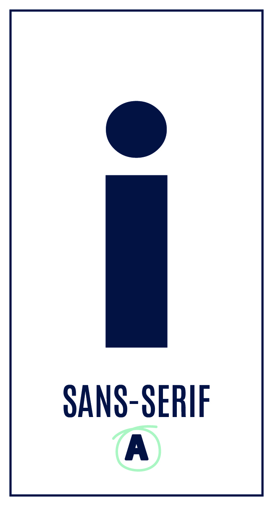

# 🎨 Font Vault – Free Fonts Collection

A carefully curated collection of **free and open-source fonts**, neatly categorized to help designers and developers find the perfect typeface faster.

Whether you're building a website, mobile app, poster, brand identity, social media design, or UI — this repo has you covered.

---

## 📂 Font Categories

- **Sans Serif** – Clean & modern fonts for UI and web
- **Serif** – Elegant fonts for articles & branding
- **Monospace** – Developer-friendly coding fonts
- **Tall / Condensed** – Bold fonts for headlines & posters
- **Display** – Creative fonts for eye-catching designs
- **Handwritten** – Natural and friendly handwritten fonts
- **Script** – Calligraphy-style flowing fonts
- **Brush / Grunge** – Rough, artistic, textured fonts
- **Retro / Vintage** – Old-school and nostalgic styles
- **Cultural Styled** – Fonts inspired by cultural & traditional designs

---

## 🗂️ Folder Structure

Fonts/ 
│ 
├── Brush-Grunge/ 
├── Cultural-Styled/ 
├── Display/ 
├── Handwritten/ 
├── Monospace/ 
├── Retro-Vintage/ 
├── Sans-Serif/ 
├── Script/ 
├── Serif/ 
├── Tall-Condensed/ 
└── README.md

---

## 🖼️ Font Preview Samples

Below are example preview images used to demonstrate font styles:

| Category | Preview |
|--------|---------|
| Sans Serif |  |
| Serif |  |
| Monospace |  |
| Tall / Condensed |  |
| Display |  |
| Handwritten |  |

> 💡 Preview images are for demonstration only. Font licenses are included where required.

---

## 🚀 How to Use

1. Open any font category folder
2. Inside, each font family is placed in its own subfolder
3. Select **all font files** (`.ttf` / `.otf`) inside the subfolder
4. Right-click and choose **Install** or **Install for all users**
5. Fonts will be ready to use in all design and development software 🎉

---

## 📢 Upcoming Updates

- More **free fonts** will be added regularly
- New font styles and categories will be introduced
- Existing folders will continue to expand over time

Stay tuned and **star ⭐ the repository** to get updates!
---

## 🤝 Contributions

Want to add more fonts?

- Fork the repository
- Add fonts to the correct category
- Include license information (if available)
- Open a Pull Request

---

## ⭐ Support

If you find this collection useful:

- Star ⭐ the repository
- Share it with designers & developers
- Post it on LinkedIn to help others

---

**Maintained with ❤️ by InfoYaseer**

